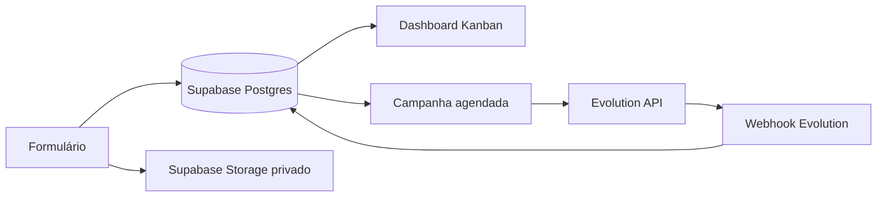

# Implantação Supabase — EmbarDaily

## Arquitetura oficial



Não há Google Sheets nem Google Drive neste fluxo. O Supabase é a única fonte de verdade.

## 1. Criar e preparar o projeto

1. Crie um projeto no Supabase Dashboard.
2. Instale a Supabase CLI, conecte o projeto e aplique a estrutura:

```bash
supabase login
supabase link --project-ref SEU_PROJECT_REF
supabase db push
supabase db seed
```

3. Em Authentication, crie os usuários internos. No SQL Editor, defina o primeiro administrador:

```sql
insert into public.profiles (id, full_name, role)
values ('UUID_DO_USUARIO', 'Nome da pessoa', 'admin');
```

As migrations criam as tabelas do CRM, as regras de acesso (RLS) e o bucket privado `embardaily-media` para fotos e vídeos.

## 2. Configurar os segredos

Em Edge Functions → Secrets, cadastre:

```text
SUPABASE_URL=https://SEU_PROJECT_REF.supabase.co
SUPABASE_SERVICE_ROLE_KEY=...
INTERNAL_FUNCTION_SECRET=um-segredo-longo
EVOLUTION_API_URL=https://evolution.seudominio.com
EVOLUTION_INSTANCE_NAME=embardaily
EVOLUTION_API_KEY=...
EVOLUTION_WEBHOOK_SECRET=outro-segredo-longo
```

Publique as functions:

```bash
supabase functions deploy evolution-webhook --no-verify-jwt
supabase functions deploy campaign-dispatch --no-verify-jwt
```

## 3. Conectar Evolution API

Configure o webhook da instância para:

```text
https://SEU_PROJECT_REF.supabase.co/functions/v1/evolution-webhook
```

Se sua Evolution suportar headers personalizados, envie `x-evolution-secret` com o valor de `EVOLUTION_WEBHOOK_SECRET`.

Agende `campaign-dispatch` uma vez por hora, enviando `x-embardaily-secret` com `INTERNAL_FUNCTION_SECRET`. A function reivindica os casos antes de enviar; por isso, um caso não recebe o Toque 1 duas vezes.

## 4. Configurar a VPS do dashboard

No `.env` da VPS, preencha somente as chaves Supabase e a proteção da interface:

```text
SUPABASE_URL=https://SEU_PROJECT_REF.supabase.co
SUPABASE_SERVICE_ROLE_KEY=...
CRM_USERNAME=admin
CRM_PASSWORD=uma-senha-forte
```

O dashboard usa essa chave apenas no servidor para consultar e alterar o Supabase. O navegador recebe somente os dados já necessários para montar o Kanban.
